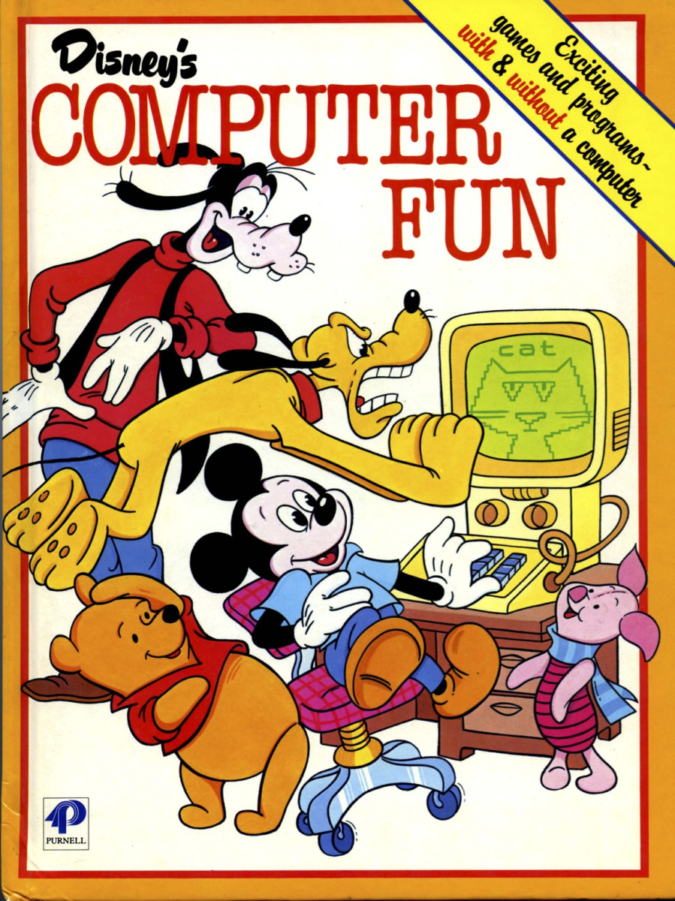

<!-- References for links -->
[pascal_wiki]: https://en.wikipedia.org/wiki/Pascal_(programming_language) "Pascal"
[c_wiki]: https://en.wikipedia.org/wiki/C_(programming_language) "C Language"
[esta]: https://www.esta.vic.gov.au "Emergency Services Telecommunications Authority"
[oua]: http://www.open.edu.au "Open Universitys Australia"
[googleLink]: https://careers.google.com/jobs/results/82102238182286022/ "Google Software Engineer"
<!-- References for images -->
[googleJob]:img/googleJob.png "Google Software Engineer"

# Personal Information

* Paul Atkins
* s3779053
* paulatkins88@gmail.com
* Studied Diploma of IT in 2005, Languages? Other than english? None. Coding? well a different answer.
* Hobbies - Goofing around with my kids! Watching trashy TV with my beautiful wife. In my personal time I write code, I am currently working on an android application specifically for my work that will calculate a years roster and display the current net take home dollar amount in 1 click (this is a bit tricky as we rotate 2 days, 2 nights, 4 off with different penalties depending on the day/night you are working.)
* Fun Fact - I like to play squash and go skateboarding with my daughters.

# Interest in IT
### You should answer the questions below as best you can. Each answer should be one paragraph in length.
* What is your interest in IT? When did your interest in IT start? Was there a particular event or person that sparked your interest? Outline your IT experience (if any).

When I was 6 years old, just learning to read my dad gave me the "Disney's Computer Fun" 

I think we had a Commodore VIC20 at the time, I guess this is where I started gaining interest in computers. I started making programs that would print funny words or absolute jibberish my father has told me, after a few years i became more interested in the hardware side of things much to my fathers disgust when I pulled apart the IBM XT to see how it ticked. Move forward a few years into high school when i started programming with [Pascal][pascal_wiki] and starting with [C][c_wiki]. This took me into a CERT IV in Information Technology which at that age (16) I really didnt give it my all and instead chased the girls and was led astray... 

At about the age of 23-24 years old I was engaged and living with my now wife and decided to go back and finish my Diploma, I had to start again at CERT IV and then the Diploma the year after. After completing this the idea was to go into a Computing Science degree and I would continue on.

Life got in the way, My fiance wanted to finish her degree in Nursing so I put aside my education and got a full time job managing fast food restaurants. 
We then moved to Ballarat after she finished her degree so she could work at the Ballarat Base Hospital and I started work at Harvey Norman, which didnt last long and if you ask anyone who works there, they would understand why. 

My friend advised me of an opportunity arising in Ballarat with [ESTA][esta] working for 000 Emergency. I believed and still do believe that it is a rewarding career with alot of pathways to other roles inside the Emergency Services Sector and I applied.

Then comes Marriage, Children and a mortgage - Suddenly I cannot resume my goal of working in the IT environment due to the fact I cant drop wage a cent to pursue full time study.

Its then someone at work said "Hey have you had a look at [OUA][oua]? I got excited about the fact that I could work fulltime and study in the down periods and on my days off.

I chose RMIT over Swinburne primarily because "Royal Melbourne **Institute of Technology**" made sense to me wanting to do a Bachelors in Information Technology. After doing some research on the lectures and job opportunities at RMIT it just cemented by decision.

I then started diving in alot of online courses in Programming as that is where my passion lies.
I have completed many courses on
* Java
* C#
* JS
* Unity3D Game engine

My favourite has been Java as it is widely used on many devices and is the main language used in Android Application Development.

My expectation of this course is to come away with the qualifications required to move from Operations at ESTA to the ITS department where I can implement positive change to the way we handle information for the interim (Gotta pay the mortgage!) then move onto something like Google.

# Ideal Job
When i think of an ideal programmer career I think about Google. Maps, Street view, Android (yes i know didnt start at Google but was purchased by them in 2005), Web development the list is endless, hence the career possibilities aswell.

[Google Software Engineer][googleLink] 
___
![Google Software Engineer][googleJob]
___

### A description (in your own words) of the position, and particularly what makes this position appealing to you.
Google are seeking a graduate after finishing university, someone to help with current projects and also to bring new ideas and new innovations. Google promote creativity! 
It is an engineering company, Sure there to make a buck but I believe are successful due to wanting to make the world of electronic engineering better than before. I would love to start a career with Google as I believe it would never become mundane, the possibilities alone to work in Australia, or anywhere in the world. And I hear they have a slide.

### A description (in your own words) of the skills, qualifications and experience required for the position.
They want a post grad, assuming adept knowledge in programming in some languages, not all. Understanding of IT, Software Development. Also mentions experience in networking prograaming (Assuming routing tables, maintaining patches, PowerShell). Experience in multiple OS (Operating Systems).

I possess the following skills relating to the role:
* OO (Object Orientated) programming languages. Java, C#, JS, Basic HTML, bash.
* Networking hardware. Router configuration, patch panels, installing rack mount hardware, 
* Working in teams groups 
* Excellent communication skills 
* Honesty & Integrity
* Fun to have around!

### A plan describing how you will obtain the skills, qualifications and experience required for the position, building on those you have now. This need not be greatly detailed, (and will probably change significantly over time anyway), but try to be as specific as you can.
My plan is to finish my Bachelors with RMIT! Keep my Linkedin profile up to date and pay attention to Googles development profile on Linkedin.

# Personal Profile
There are a number of online tests that are commonly used by employers to get specific information about potential employees. One of the best-known of these is the Myers-Briggs Type Indicator (MBTI) test, which was developed by the mother-and-daughter team of Isabel Myers and Katharine Briggs. Another popular one (and very relevant to students) is about learning styles.

There are various other tests available online as well, and while there is no guarantee that any specific test will be necessarily one that you will encounter in your career, it seems highly likely that you will have to do some kind of test like this as part of a recruitment process.

Accordingly, you are required to present the following information:

* The results of an online Myers-Briggs test. <!-- https://www.16personalities.com/profiles/b4a3e22f20a4f -->
The results of the MBTI test seem to make me feel like a fence sitter! with most of the personality traits being very even, tipping only so slightly in one direction. 
I agree that i am an extraverted person and dont have any trouble identifying in a group and I am energised by social interaction. Whilst I do like coding by myself, I do like to have input on design and how a program should function. Under the energy subtitle it calls me observant which is half correct, depends on the exercise. Listening to the wife about groceries and what needs to be done around the house? Not so much. When it comes to working on a group project this is correct i like to stay factual and keep a group moving forward rather than procrastation. I wouldnt put myself in the "Feeling" category though, I do believe in harmony in groups but struggle sometimes with other peoples emotions - "Lets just get it done!" Hence the next two titles puts me in the "Judging" & "Assertive" categories... agreed.

* The results of an online learning style test. <!-- img/learningStyle.png -->
100% agree with this, I am a visual learner. I have self taught myself all my coding languages by reading pdf's, watching YouTube tutorials. It goes on to say that I have difficulty with spoken directions? Incorrect its how I learn! Following what someone is doing and then going to read about it to fully understand. "distracted by sounds"? Whilst writing this now I have two young kids running around screaming daddy whilst mum says please be quiet also have music in my ears so I dont know how accurate this one is.

* The results of one further online test of your choosing. <!-- https://www.123test.com/report/ENC1VSNHSKXQJQ -->
I chose the Big Five test (was going to do a speed coder test, thought this might be more relevant). As per the MBTI test it puts me in the Extravert category, again I agree with this I enjoy group work, I get along well with others. 

* What do the results of these tests mean for you?
They are somewhat accurate. I dont believe people can be put in a box as humans are too diverse and situation/exposure can change anyones personality. That being said, I do like that it highlights some down points where you could work on behaviours to grow as a person.

* How do you think these results may influence your behaviour in a team?
As said before, the results highlight areas that may not be productive in a team environment. Giving insight on how you may improve in a group, maybe I am too extrovert? too rigid in my processes and need to more open minded. I will try and explore these traits before the group projects start.

* How should you take this into account when forming a team?
Try and align myself with other individuals that have high competencies to get a balanced group. Be mindful of my strong traits and possibly dial back a bit and listen. 

# Project Idea
You are to write a report of around 1000 words describing your project idea. You should describe the project itself, as well as why you think it is important or interesting, and any potential drawbacks or obstacles you anticipate.

What are you passionate about? What kind of IT innovation would you like to see? What project will help you develop the skills, experience and knowledge required to make you qualified for your ideal job?

You need not have full answers to any of these questions, but you are required to have some ideas about an IT project that you think will address at least one of these questions. It may not be possible to find one that answers all three, but it is quite likely that something you would find interesting or useful will have a similar effect on others.

There are a number of possible types of projects that you may consider. Some potential ideas are below; others will be discussed in the following weeks.

Developing a game using tools such as Unity, Construct2 or Cocos2d.
Developing a smartphone app, using whatever programming language in which you have expertise, or by using tools such as MIT App Inventor.
Finding an innovative application for new hardware developments, such as Raspberry Pis, Arduinos, Makey Makeys, small robots or related technologies.
Creating a FAQ and implementing it as a chatterbot, possibly involving speech-to-text and text-to-speech software.
Building an electronic artefact such as a model for Minecraft or similar games, along the lines of the United Nations Block by Block project.
For this assignment, you need to write approximately 1,000 words about your project idea.

This should not only describe what the project would be, but also why you think it is important or interesting, and what potential drawbacks or obstacles you anticipate.

Your description should include the following sections. The word counts below are recommendations only not absolutes but are a good guide.

__Overview__ (100 words) - This should be a summary of what the project will be.

__Motivation__ (100) words) - This should be a description of why the project will be interesting or useful. This may include statistics or other evidence, such as: "There 
service. are 1.5 billion cat owners in Australia, and so there is a huge market for an automated cat feeder. Using Raspberry Pi technology is a cheap and easily assembled solution to this problem."

__Description__ (500 words) - Detailed description of the features of the product or service

__Tools and Technologies__ (100) words) - Describe the software, hardware and/or other equipment needed. Include any relevant open source tools as appropriate.

__Skills Required__ (100 words) - List the skills are required for your project, including software that needs to be written, and special hardware (if any). How feasible will it be to find the skills, software and hardware required?

__Outcome__ (100 words) - If the project is successful, what will be the outcome? How will the original problem be solved? What impact will this development have?

