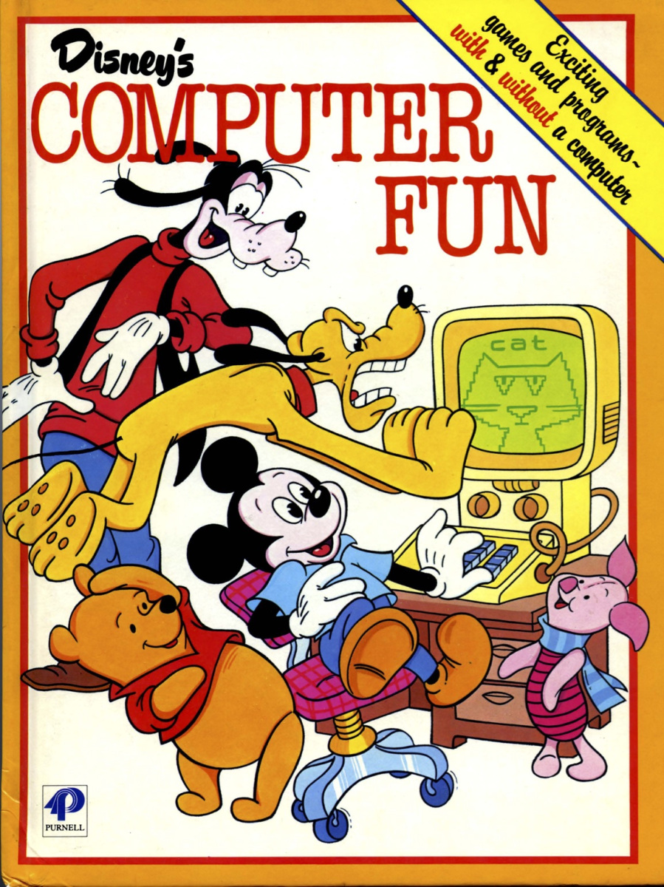

<!-- References for links -->
[home]:index "Home"
[pascal_wiki]: https://en.wikipedia.org/wiki/Pascal_(programming_language) "Pascal"
[c_wiki]: https://en.wikipedia.org/wiki/C_(programming_language) "C Language"
[esta]: https://www.esta.vic.gov.au "Emergency Services Telecommunications Authority"
[oua]: http://www.open.edu.au "Open Universitys Australia"
[googleLink]: https://careers.google.com/jobs/results/82102238182286022/ "Google Software Engineer"
<!-- References for images -->
[googleJob]:img/googleJob.png "Google Software Engineer"
[mbtiResult]:img/mbtiResult.png "MBTI Result"
[bigFiveResult]:img/bigFiveResult.png "Big 5 Result"
[learningStyle]:img/learningStyle.png "Learning style Result"

# Interest in IT
### You should answer the questions below as best you can. Each answer should be one paragraph in length.
* What is your interest in IT? When did your interest in IT start? Was there a particular event or person that sparked your interest? Outline your IT experience (if any).

When I was 6 years old, just learning to read my dad gave me the "Disney's Computer Fun" 

I think we had a Commodore VIC20 at the time, I guess this is where I started gaining interest in computers. I started making programs that would print funny words or absolute jibberish my father has told me, after a few years i became more interested in the hardware side of things much to my fathers disgust when I pulled apart the IBM XT to see how it ticked. Move forward a few years into high school when i started programming with [Pascal][pascal_wiki] and starting with [C][c_wiki]. This took me into a CERT IV in Information Technology which at that age (16) I really didnt give it my all and instead chased the girls and was led astray... 

At about the age of 23-24 years old I was engaged and living with my now wife and decided to go back and finish my Diploma, I had to start again at CERT IV and then the Diploma the year after. After completing this the idea was to go into a Computing Science degree and I would continue on.

Life got in the way, My fiance wanted to finish her degree in Nursing so I put aside my education and got a full time job managing fast food restaurants. 
We then moved to Ballarat after she finished her degree so she could work at the Ballarat Base Hospital and I started work at Harvey Norman, which didnt last long and if you ask anyone who works there, they would understand why. 

My friend advised me of an opportunity arising in Ballarat with [ESTA][esta] working for 000 Emergency. I believed and still do believe that it is a rewarding career with alot of pathways to other roles inside the Emergency Services Sector and I applied.

Then comes Marriage, Children and a mortgage - Suddenly I cannot resume my goal of working in the IT environment due to the fact I cant drop wage a cent to pursue full time study.

Its then someone at work said "Hey have you had a look at [OUA][oua]? I got excited about the fact that I could work fulltime and study in the down periods and on my days off.

I chose RMIT over Swinburne primarily because "Royal Melbourne **Institute of Technology**" made sense to me wanting to do a Bachelors in Information Technology. After doing some research on the lectures and job opportunities at RMIT it just cemented by decision.

I then started diving in alot of online courses in Programming as that is where my passion lies.
I have completed many courses on
* Java
* C#
* JS
* Unity3D Game engine

My favourite has been Java as it is widely used on many devices and is the main language used in Android Application Development.

My expectation of this course is to come away with the qualifications required to move from Operations at ESTA to the ITS department where I can implement positive change to the way we handle information for the interim (Gotta pay the mortgage!) then move onto something like Google.

[back][home]